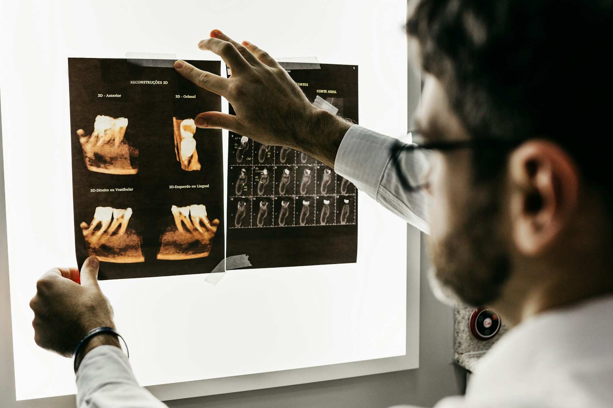

<div align="center">

# Aurelia Dental

### Премиальный сайт частной стоматологической клиники

*Светлая editorial-эстетика · плавные анимации · полная адаптивность · SEO*

<br>


<br>



<br>

[О проекте](#-о-проекте) ·
[Возможности](#-возможности) ·
[Страницы](#-страницы) ·
[Запуск](#-запуск) ·
[Структура](#-структура)

</div>

---

## ✦ О проекте

**Aurelia Dental** — коммерческий концепт сайта стоматологии в Москве.

Проект показывает, как может выглядеть современная медицинская клиника в сети: спокойная палитра, продуманная типографика, реалистичный русскоязычный контент и аккуратные интерактивные детали — без перегруза и «клинического» холода.

> Подходит для демонстрации клиенту, портфолио и передачи frontend-команде.

| | |
|---|---|
| **Тип** | Статический сайт, zero build |
| **Язык** | Русский |
| **Страниц** | 20+ |
| **Анимации** | GSAP + Lenis |
| **Адаптив** | 360 px — 1920 px |

---

## ✦ Возможности

<table>
<tr>
<td width="50%" valign="top">

**Дизайн и UX**
- Светлый luxury UI
- Editorial-карточки
- Тёплая нейтральная палитра
- Кастомный курсор (desktop)
- Фиксированная CTA на mobile

**Интерактив**
- Слайдер «до / после»
- Lightbox-галерея
- FAQ-аккордеон
- Форма записи с валидацией

</td>
<td width="50%" valign="top">

**Техническая часть**
- GSAP ScrollTrigger
- Плавная прокрутка Lenis
- Sticky header + mobile menu
- Блокировка скролла в модалках
- Dynamic doctor / article pages

**SEO и a11y**
- Open Graph + Schema.org
- `sitemap.xml` + `robots.txt`
- Skip-link, ARIA, focus-visible
- `prefers-reduced-motion`

</td>
</tr>
</table>

---

## ✦ Страницы

| Раздел | Файл |
|:--|:--|
| Главная | `index.html` |
| Услуги | `services.html` |
| Виниры · Импланты · Отбеливание · Ортодонтия · Терапия | `service-*.html` |
| Врачи | `doctors.html` |
| Профиль врача | `doctor.html?id=volkov` |
| Цены · Клиника · О нас | `prices.html`, `clinic.html`, `about.html` |
| Галерея · Отзывы · Журнал | `gallery.html`, `reviews.html`, `journal.html` |
| Контакты | `contacts.html` |
| Privacy · Terms · 404 | `privacy.html`, `terms.html`, `404.html` |

---

## ✦ Дизайн-система

```
Стиль     light luxury · warm ivory · editorial medical
Фоны      тёплый белый, ivory, мягкий крем
Текст     charcoal, глубокий графит
Акцент    приглушённое шампанское золото
Шрифты    Cormorant Garamond (заголовки) + Manrope (текст)
```

---

## ✦ Запуск

Сборка не требуется — проект полностью статический.

```bash
# Вариант 1 — Python
python -m http.server 8080

# Вариант 2 — Node
npx serve .
```

Откройте в браузере: **http://localhost:8080**

<details>
<summary><strong>Дополнительные команды</strong></summary>

<br>

```bash
# Загрузить изображения (если папка assets/images/ пуста)
node scripts/download-images.js

# Перегенерировать HTML-страницы
node scripts/generate-pages.js
```

</details>

---

## ✦ Структура

```
aurelia-dental/
├── index.html                 # Главная
├── css/
│   ├── style.css              # Дизайн-система
│   └── responsive.css         # Адаптив
├── js/
│   ├── animations.js          # GSAP + Lenis
│   ├── booking.js             # Форма записи
│   ├── navigation.js          # Меню
│   └── main.js                # Интерактив
├── assets/images/             # Фотографии
├── scripts/                   # Генераторы
├── sitemap.xml
└── robots.txt
```

---

<div align="center">

**Aurelia Dental** — portfolio / concept project

Название бренда и материалы используются в демонстрационных целях.

</div>
